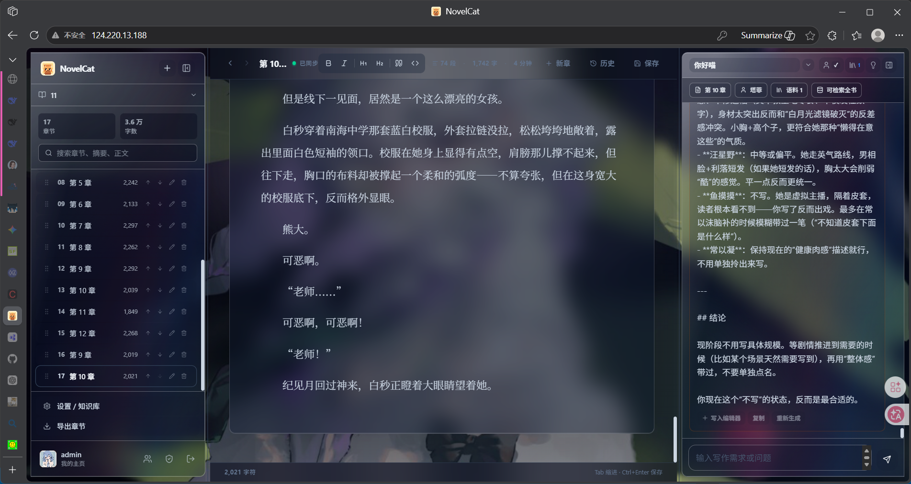

写作网站，ai对话 





## 前端

- 三栏布局：左边章节列表，中间编辑器，右边 AI 对话
- RAG 知识库：参考文档
- 三种主题切换、实时自动保存

## 技术栈

- 后端：FastAPI + SQLModel + ChromaDB
- 前端：Next.js + React
- AI：DeepSeek / OpenAI

## 链接

- [FastAPI 官方文档](https://fastapi.tiangolo.com/zh/)
- [GitHub 仓库](https://github.com/shystab/ChatNovel)

## What can I say

目前实际做出的内容 除了手打 其他体验都很屎 

