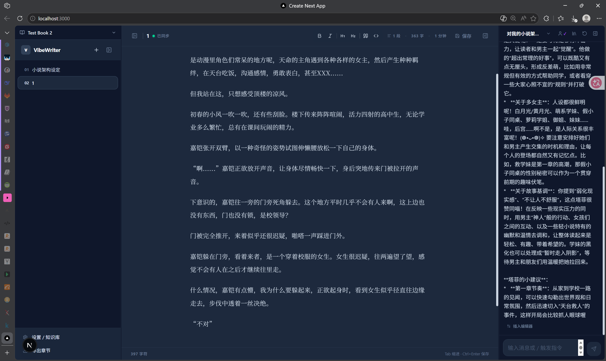
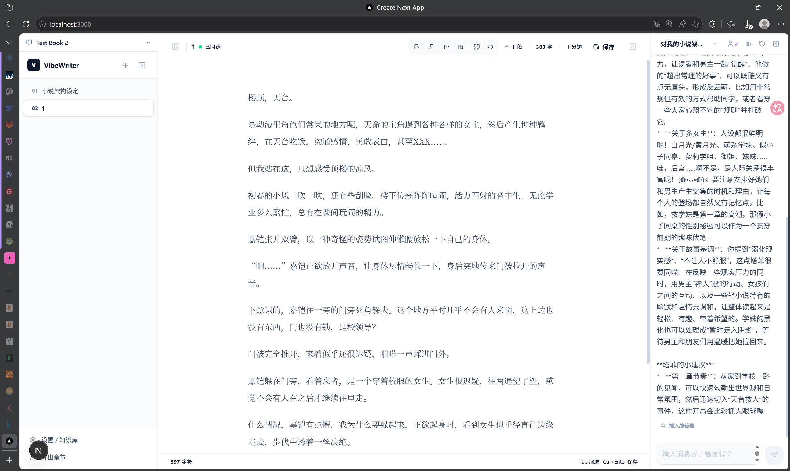

> 一个为小说创作者量身定制的AI写作环境，结合了现代IDE的高效与AI智能的创造力。

## 📖 项目概述

**Novel IDE (Fast)** 是一个全栈AI小说写作助手，旨在为小说创作者提供一个集写作、编辑、AI辅助于一体的现代化写作环境。项目采用前后端分离架构，后端基于FastAPI构建，前端使用Next.js 16（App Router）+ React 19，支持RAG（检索增强生成）知识库和智能写作辅助功能。




## ✨ 核心功能亮点

### 🤖 AI写作助手

- **智能续写**：基于当前上下文自动续写，保持风格一致性
- **文本改写**：润色和改进现有文本，提升表达质量
- **语法检查**：识别和纠正写作中的语法和风格问题
- **情节建议**：基于当前内容生成情节发展方向

### 📚 RAG知识库系统

- **文档上传**：支持TXT、PDF、DOCX格式的参考文档上传
- **语义搜索**：跨上传材料的智能语义搜索
- **上下文注入**：AI写作时自动参考相关材料，实现风格模仿
- **向量存储**：使用ChromaDB进行文本向量化存储和检索

### 🎨 现代IDE界面

- **三面板布局**：章节列表（左）、编辑器（中）、AI聊天（右）
- **主题切换**：明亮、暗黑、护眼三种主题可选
- **实时保存**：防抖自动保存，防止内容丢失
- **响应式设计**：可调整大小的面板，适应不同屏幕

### ⚙️ 高级特性

- **人格预设系统**：可定制的AI角色扮演，支持不同写作风格
- **写作记忆**：上下文感知的智能辅助，记忆角色和情节
- **多书籍管理**：同时管理多个写作项目
- **工具调用**：AI可以访问章节内容和参考资料

## 🏗️ 技术架构简介

### 后端技术栈（FastAPI + Python）

```python
# 后端架构概览
FastAPI       → 现代异步Web框架
SQLModel      → SQLAlchemy + Pydantic混合ORM
ChromaDB      → 向量数据库（RAG存储）
Sentence Transformers → 文本嵌入模型
DeepSeek/OpenAI → AI提供商抽象层
```

后端采用FastAPI构建RESTful API和WebSocket服务，使用SQLModel处理数据库操作，ChromaDB存储向量数据，支持DeepSeek和OpenAI双AI提供商。

### 前端技术栈（Next.js + React）

```typescript
// 前端架构概览
Next.js 16     → React框架（App Router）
React 19       → 最新React特性
TypeScript     → 类型安全开发
Tailwind CSS v4 → 实用优先样式
React Resizable Panels → 可调整面板布局
```

前端使用Next.js 16的App Router架构，React 19提供最新特性支持，Tailwind CSS实现现代化UI设计，TypeScript确保代码质量。

## 🎯 使用场景

### 小说创作
- **长篇连载**：管理多章节小说，AI辅助情节发展
- **短篇故事**：快速构思和完成短篇创作
- **风格模仿**：通过RAG学习特定作者的写作风格

### 内容优化
- **文本润色**：改进现有稿件的表达质量
- **情节拓展**：为卡顿的情节提供发展方向
- **角色塑造**：通过AI对话完善角色设定

### 写作学习
- **写作练习**：通过AI反馈提升写作技巧
- **风格研究**：分析不同作者的写作特点
- **创意激发**：获取创作灵感和素材

## 🌟 项目特色

### 本地优先设计
所有写作内容默认存储在本地，AI API调用外不依赖外部服务，保护用户隐私和创作版权。

### RAG增强创作
将AI大模型与个人知识库结合，实现真正个性化的写作辅助，而非通用模板输出。

### 开发者友好
项目结构清晰，代码注释完整，适合学习和二次开发。提供完整的开发文档和配置指南。

### 跨平台支持
基于Web技术栈，支持Windows、macOS、Linux系统，可通过浏览器随时随地访问。

## 🚀 快速体验

```bash
# 1. 克隆项目
git clone https://github.com/shystab/ChatNovel.git
cd ChatNovel

# 2. 启动后端
cd backend
python -m uvicorn app.main:app --reload --port 8000

# 3. 启动前端  
cd frontend
npm run dev

# 4. 浏览器访问
# 前端：http://localhost:3000
# API文档：http://localhost:8000/docs
```

项目已发布在GitHub：[shystab/ChatNovel](https://github.com/shystab/ChatNovel)，欢迎Star和贡献！

## 💭 结语

Novel IDE (Fast)不仅是一个写作工具，更是一个探索AI与创作结合的实验场。它将现代开发技术应用于传统创作领域，为小说创作者提供了一个高效、智能、个性化的写作环境。

在这个AI技术快速发展的时代，创作者需要的不只是工具，而是能够理解创作意图、辅助而非替代创造力的智能伙伴。Novel IDE正是朝着这个方向的一次尝试。


> 创作不止于文字，技术不止于代码。在Novel IDE的世界里，每一次按键都是故事的新篇章。

---

**项目状态**：持续开发中，欢迎反馈和建议！

**GitHub仓库**：[shystab/ChatNovel](https://github.com/shystab/ChatNovel)

**技术交流**：欢迎在GitHub Issues或通过博客评论交流