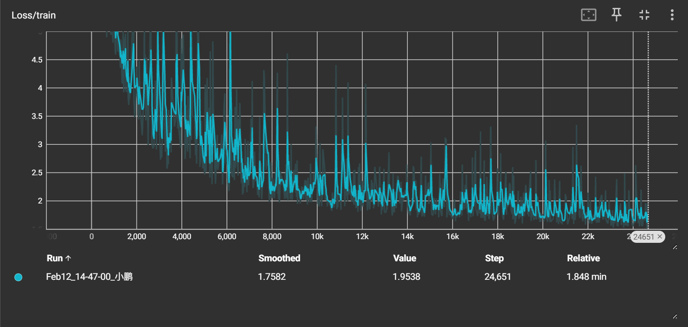
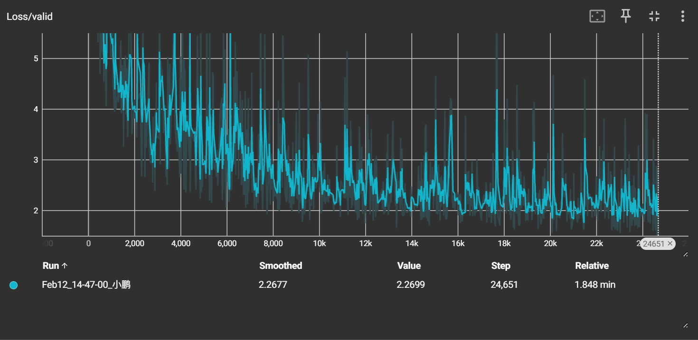
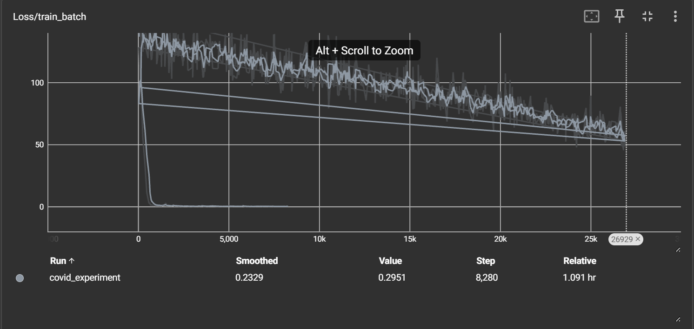
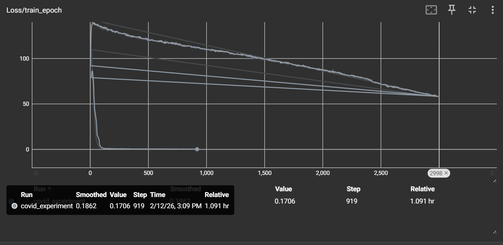
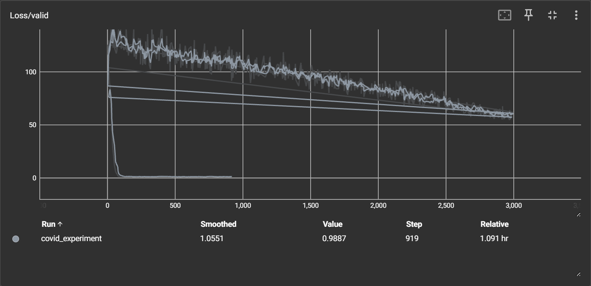

# 复现李宏毅老师 HW1 COVID-19 回归任务

## 1. 理解基础 Demo
作业提供的 demo 代码结构清晰，特征维度为 117，模型仅包含两层隐藏层（16 和 8 个神经元），使用 SGD 优化器。

### 1.1 demo模型 数据是 117 维特征，网络只有两层隐藏层（16 和 8 个神经元）
开始先是理解demo代码：
```python
class My_Model(nn.Module):
    def __init__(self, input_dim):
        super().__init__()
        self.layers = nn.Sequential(
            nn.Linear(input_dim, 16),
            nn.ReLU(),
            nn.Linear(16, 8),
            nn.ReLU(),
            nn.Linear(8, 1)
        )
    def forward(self, x):
        return self.layers(x).squeeze()
```
### 1.2 理解深度学习代码框架：
1. 配置模块（config.py / config dictionary）
职责：集中管理所有超参数、文件路径、随机种子等，便于修改和复现实验。

2. 数据模块（dataset.py）
职责：数据加载、预处理、划分训练/验证集，定义 Dataset 和 DataLoader。

3. 模型模块（model.py）
职责：定义神经网络结构，通常继承 nn.Module。

4. 训练模块（train.py）
职责：包含训练循环、验证、早停、学习率调度、日志记录等。

以及工具函数 数据处理 预测 tensorboard等等 并非绝对模块化

## 2 动手改进模型
在理解基础代码后（其实是一个略微艰难的事 万事开头难），我开始尝试改进模型

###　2.1 加宽加深 + Batch Normalization
为了提升模型能力，我决定把网络加深加宽，改成 64→32→16→1 的结构，并引入 Batch Normalization（BN）：

BN 的作用是让每一层的输入分布稳定，加速收敛，还能起到轻微的正则化效果。

```python
class MyModel(nn.Module):
    def __init__(self, input_dim):
        super().__init__()
        self.layers = nn.Sequential(
            nn.Linear(input_dim, 64),
            nn.BatchNorm1d(64),
            nn.ReLU(),
            nn.Linear(64, 32),
            nn.BatchNorm1d(32),
            nn.ReLU(),
            nn.Linear(32, 16),
            nn.BatchNorm1d(16),
            nn.ReLU(),
            nn.Linear(16, 1)
        )
    
    def forward(self, x):
        return self.layers(x).squeeze() 
```

###　2.2 切换优化器与调整学习率
demo 使用 SGD 优化器，学习率设为 1e-5 以保证稳定性。我尝试改用 Adam 优化器，并大幅提升学习率，结果令人惊喜。

~~~python
optimizer = torch.optim.SGD(model.parameters(), lr=config['learning_rate'], momentum=0.9) 
~~~
(momentum为动量 更好进行梯度下降)
~~~python
optimizer = torch.optim.Adam(model.parameters(), lr=config['learning_rate'])
~~~

demo最后训练loss大约在2左右

我的训练三轮（其实不止三轮 很多训练数据在摸索阶段都删掉了）

起初，我的训练 loss 非常大，模型几乎不收敛。我反复检查代码、调整结构，效果仍然不明显。

我直接把学习率从 1e-5 提升到了 1e-3 loss直接到0左右~震惊~

 **嗯哼**：SGD 需要极小的学习率保证稳定，但 Adam 配合 BN 可以承受更大的步长。 

总之最后跑完了HW-1（还算顺利）

## 3. 实验对比与结果
记录了训练过程中的 loss 曲线。

以下为训练tensorboard
demo






mywork





（注：图片仅展示最终稳定训练的部分，前期摸索阶段的多次尝试已删去。）

## 4. 总结与收获
通过这次 HW1 的实践，我不仅复习了回归任务的基本流程，更重要的是：
理解了 Batch Normalization 的作用与效果。
亲身体验了优化器（SGD vs Adam）和学习率对训练的巨大影响。
学会了如何通过调整超参数快速调试模型。
积累了深度学习项目的基本代码框架意识。
虽然过程有些曲折（还行哈哈），但最终顺利跑完了 HW1，为后续更复杂的作业打下了基础。接下来继续加油喵 