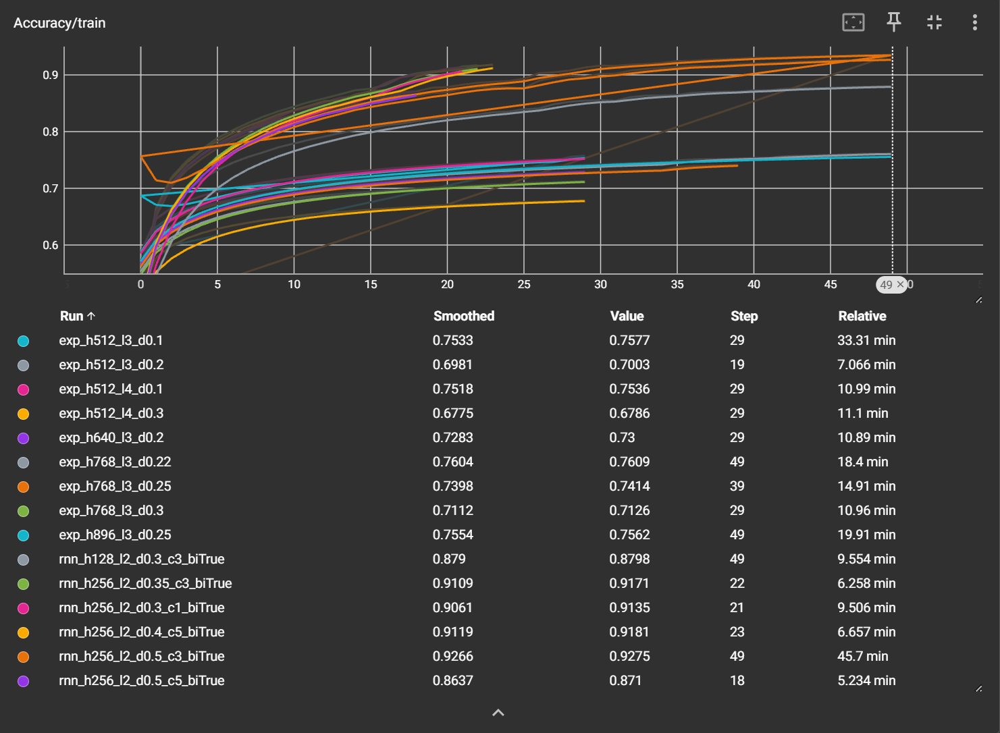
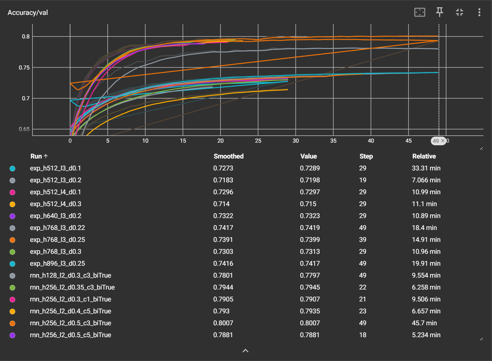
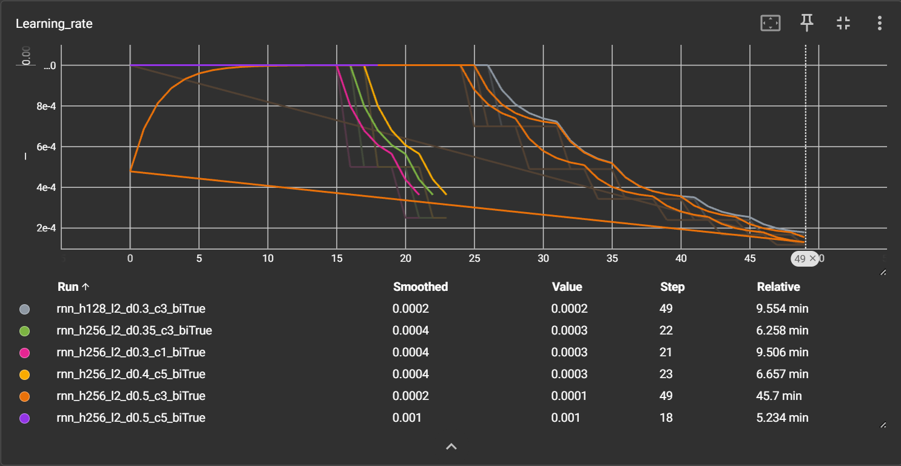

# 李宏毅 HW2：音素识别任务学习记录

寒假深度学习的第二个作业是**音素识别**——一个帧级别的分类任务。输入是语音的 MFCC 特征，需要为每一帧预测对应的音素标签（共 41 类）。本文将记录我从基线模型到 RNN 的探索过程，以及最终达到 0.80 验证准确率的一些心得。

## 1. 数据特点

作业提供的数据已经预处理完毕，存储在 `.pt` 文件中。主要特点如下：

- **训练集**：3428 句话，每句话帧数不等。
- **验证集**：858 句话。
- **测试集**：若干句话（无标签）。
- **每帧特征**：39 维 MFCC。
- **每帧标签**：0 ~ 40 的整数，对应 41 个音素类别。

这是一个典型的序列分类问题，需要模型能够捕捉语音帧之间的时序依赖。

直接说结果 最后acc（只有val部分）跑到0.8（用的RNN）
虽然还是没有到课程的0.82（boss线）但已经尽力了（悲）

## 2 基线模型（全连接）
沿用demo的思路，用全连接网络，但配合了 concat_nframes 让每个时间步看到前后帧。模型结构：
```python
class BasicBlock(nn.Module):# 继承 torch 的 Module
    def __init__(self, input_dim, output_dim):
        super(BasicBlock, self).__init__()

        self.block = nn.Sequential(
            nn.Linear(input_dim, output_dim),
            nn.BatchNorm1d(output_dim),
            nn.ReLU(),
            nn.Dropout(dropout_rate)  # 训练时随机丢弃 20% 神经元
        )

    def forward(self, x):
        x = self.block(x)
        return x
class Classifier(nn.Module):
    def __init__(self, input_dim, output_dim=41, hidden_layers=1, hidden_dim=256):
        super(Classifier, self).__init__()

        layers = []
        layers.append(BasicBlock(input_dim, hidden_dim))
        for _ in range(hidden_layers):
            layers.append(BasicBlock(hidden_dim, hidden_dim))
        layers.append(nn.Linear(hidden_dim, output_dim))
        self.fc = nn.Sequential(*layers)

    def forward(self, x):
        x = self.fc(x)
        return x
```
## 3　RNN 模型（主力）
为了利用时序信息（其实是卡在0.79），我换成了 双向 LSTM，结构如下：
```python
class RNNClassifier(nn.Module):
    def __init__(self, input_dim, hidden_dim, num_layers, num_classes, dropout=0.3):
        super().__init__()
        self.lstm = nn.LSTM(
            input_dim, hidden_dim, num_layers,
            batch_first=True, dropout=dropout, bidirectional=True
        )
        self.dropout = nn.Dropout(dropout)
        self.fc = nn.Linear(hidden_dim * 2, num_classes)

    def forward(self, x, lengths):
        packed_x = pack_padded_sequence(x, lengths.cpu(), batch_first=True, enforce_sorted=False)
        packed_out, _ = self.lstm(packed_x)
        out, _ = pad_packed_sequence(packed_out, batch_first=True)
        out = self.dropout(out)
        out = self.fc(out)   # (batch, max_len, num_classes)
        return out
```
做到了0.80嘻嘻

## 训练过程

tensorboard图像：






## 回想
可惜没有做到0.82的boss限
不过也算是学到了RNN等一些东西（甚至实操更多于原理）


