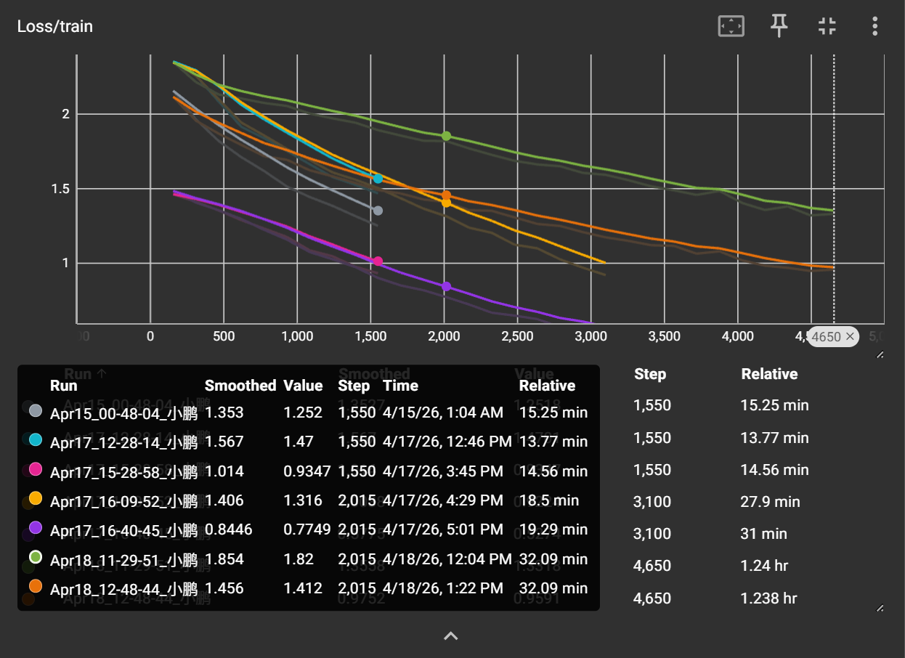
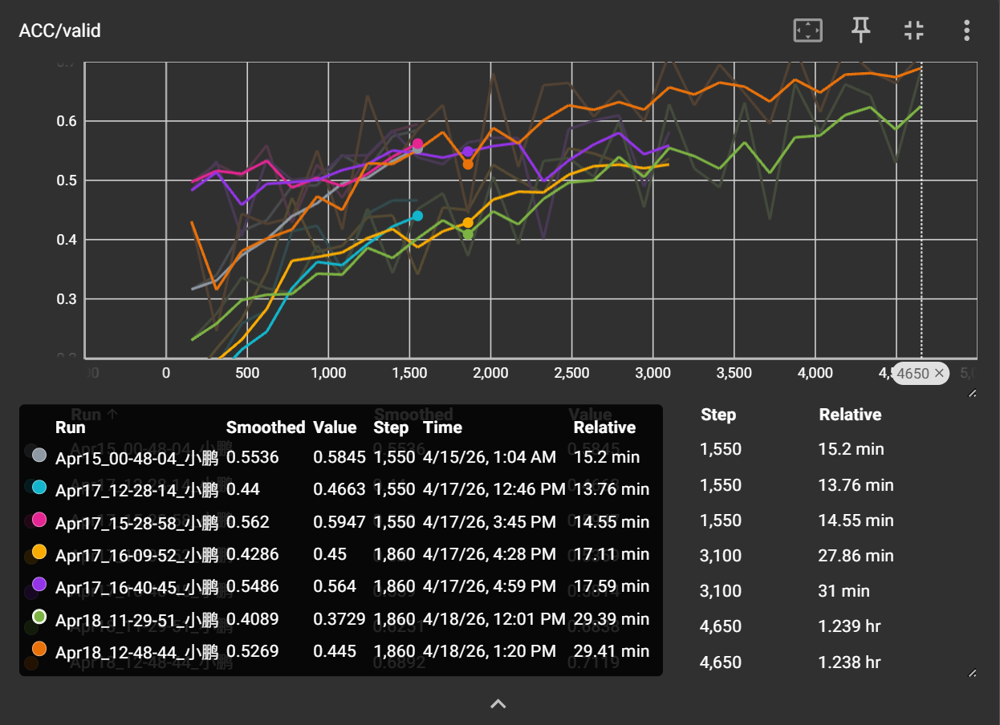

# 李宏毅 HW3：图像分类任务学习记录

寒假深度学习的第三个作业是**图像分类**——一个经典的计算机视觉任务。

## 1. 数据特点

作业提供的数据集是 一些食物小尺寸图像数据集。主要特点如下：

- **训练集**：很多 张图像，每张尺寸为 124*124（RGB）。
- **测试集**：很多 张图像。（其实我没看有多少）
- **类别数**：11 类（

这是一个典型的图像分类问题，需要模型能够提取局部特征并保持空间不变性。

## 2. 基线模型（简单 CNN）

助教（或者github上传的人提供的？）的model

```python
import torch.nn as nn

class Classifier(nn.Module):
    def __init__(self):
        super(Classifier, self).__init__()
        # input 維度 [3, 128, 128]
        self.cnn = nn.Sequential(
            nn.Conv2d(3, 64, 3, 1, 1),  # [64, 128, 128]
            nn.BatchNorm2d(64),
            nn.ReLU(),
            nn.MaxPool2d(2, 2, 0),      # [64, 64, 64]

            nn.Conv2d(64, 128, 3, 1, 1), # [128, 64, 64]
            nn.BatchNorm2d(128),
            nn.ReLU(),
            nn.MaxPool2d(2, 2, 0),      # [128, 32, 32]

            nn.Conv2d(128, 256, 3, 1, 1), # [256, 32, 32]
            nn.BatchNorm2d(256),
            nn.ReLU(),
            nn.MaxPool2d(2, 2, 0),      # [256, 16, 16]

            nn.Conv2d(256, 512, 3, 1, 1), # [512, 16, 16]
            nn.BatchNorm2d(512),
            nn.ReLU(),
            nn.MaxPool2d(2, 2, 0),       # [512, 8, 8]
            
            nn.Conv2d(512, 512, 3, 1, 1), # [512, 8, 8]
            nn.BatchNorm2d(512),
            nn.ReLU(),
            nn.MaxPool2d(2, 2, 0),       # [512, 4, 4]
        )
        self.fc = nn.Sequential(
            nn.Linear(512*7*7, 1024),
            nn.ReLU(),
            nn.Linear(1024, 512),
            nn.ReLU(),
            nn.Linear(512, 11)
        )

    def forward(self, x):
        out = self.cnn(x)
        out = out.view(out.size()[0], -1)
        return self.fc(out)
```

## 3. 改进模型（更深的 CNN + 正则化）

试着用b站一哥们视频教程写的，似乎是block思想 但好像不能跑啊 因为似乎传来传去的尺寸是不对的

###　CNN的卷积核padding如何确定以及stride：

padding=kernal-size-1/2（所以卷积核大小一般取负数）

Stride目标是减少特征图的空间维度（即进行下采样）通常会设置Stride为2或更大。这可以替代池化层（Pooling）的作用，直接降低计算量

常见场景：

1. 网络的第一个卷积层，用于快速减小输入图像（如224x224）的尺寸，降低后续计算量。

2. 在需要降低特征图分辨率的残差块（Residual Block）中，替代池化层。

> 重要提醒：当Stride > 1时，Padding 通常不再是 (kernel_size - 1) / 2。你需要使用核心公式来精确计算输出尺寸，确保网络结构连通。（怎么算的我没理解）似乎是kernalsize-1/stride+1 然后向上取整？

(输入 + 2×Padding - 卷积核) / Stride=输出
```python
class CNNBlock(nn.Module):
    def __init__(self,in_channels,out_channels,kernal_size,stride,padding):
        super(CNNBlock,self).__init__()
        self.cnn=nn.Sequential(
            nn.Conv2d(in_channels,out_channels,kernal_size,stride,padding),
            nn.BatchNorm2d(out_channels),
        )
    def forward(self,x):
        x=self.cnn(x)
        return x

class Residual_Network(nn.Module):
    def __init__(self):
        super(Residual_Network,self).__init__()

        self.cnn_layer1=nn.Sequential(
            CNNBlock(3,64,3,1,1)
        )
        self.cnn_layer2=nn.Sequential(
            CNNBlock(64,64,3,1,1)
        )
        self.cnn_layer3=nn.Sequential(
            CNNBlock(64,128,3,2,1)
        )
        self.cnn_layer4=nn.Sequential(
            CNNBlock(128,128,3,1,1)
        )
        self.cnn_layer5=nn.Sequential(
            CNNBlock(128,256,3,2,1)
        )
        self.cnn_layer6=nn.Sequential(
            CNNBlock(256,256,3,1,1)
        )
        self.fc_out=nn.Sequential(
            nn.Linear(256*32*32,256),
            nn.ReLU(0),
            nn.Linear(256,11)
        )

        self.relu=nn.ReLU()

    def forward(self,x):
        X1=self.cnn_layer1(x)
        X1=self.relu(X1)

        X2=self.cnn_layer2(X1)
        X2=X1+X2
        X2=self.relu(X2)

        X3=self.cnn_layer3(X2)
        X3=X2+X3
        X3=self.relu(X3)

        X4=self.cnn_layer4(X3)
        X4=X3+X4
        X4=self.relu(X4)

        X5=self.cnn_layer5(X4)
        X5=X4+X5
        X5=self.relu(X5)

        X6=self.cnn_layer6(X5)
        X6=X5+X6
        X6=self.relu(X6)

        xout=X6.flatten(1)
        xout=self.fc_out(xout)
        return xout
```
最开始不理解这份为什么错 但这种方法确实不方便维护 
一个标准的残差块（BasicBlock）需要满足：

1. 当跳跃连接的通道数或尺寸发生变化时，必须使用 1×1 卷积（shortcut） 对输入进行投影，使其形状与主路径输出一致。

2. 主路径通常包含两个卷积层，每个卷积后接 BN 和 ReLU，最后在相加后再接 ReLU。

3. 分类部分推荐使用 全局平均池化（AdaptiveAvgPool2d） 代替手动展平，避免维度计算错误。

### 这似乎是正确的代码(DEEPSEEK提供)
```python
import torch.nn as nn
import torch.nn.functional as F

class CNNBlock(nn.Module):
    def __init__(self, in_channels, out_channels, kernel_size, stride, padding):
        super(CNNBlock, self).__init__()
        self.cnn = nn.Sequential(
            nn.Conv2d(in_channels, out_channels, kernel_size, stride, padding, bias=False),
            nn.BatchNorm2d(out_channels),
        )

    def forward(self, x):
        return self.cnn(x)

class Residual_Network(nn.Module):
    def __init__(self, num_classes=11):
        super(Residual_Network, self).__init__()

        # 注意：当跳跃连接的通道数或尺寸不匹配时，需要调整 shortcut
        # 为了简化，这里使用 1x1 卷积来统一通道

        # Block 1: 64 -> 64 (stride=1, 无尺寸变化，直接相加)
        self.block1_conv1 = CNNBlock(3, 64, 3, 1, 1)
        self.block1_conv2 = CNNBlock(64, 64, 3, 1, 1)
        self.relu = nn.ReLU(inplace=True)

        # Block 2: 64 -> 128 (stride=2, 尺寸减半，通道翻倍，需要 shortcut 调整)
        self.block2_conv1 = CNNBlock(64, 128, 3, 2, 1)
        self.block2_conv2 = CNNBlock(128, 128, 3, 1, 1)
        self.shortcut2 = nn.Conv2d(64, 128, kernel_size=1, stride=2, bias=False)
        # shortcut就是让残差中的x和F(x)可以相匹配

        # Block 3: 128 -> 256 (stride=2, 尺寸减半，通道翻倍，需要 shortcut 调整)
        self.block3_conv1 = CNNBlock(128, 256, 3, 2, 1)
        self.block3_conv2 = CNNBlock(256, 256, 3, 1, 1)
        self.shortcut3 = nn.Conv2d(128, 256, kernel_size=1, stride=2, bias=False)

        # 全局平均池化 + 分类层
        self.avgpool = nn.AdaptiveAvgPool2d((1, 1))
        self.fc = nn.Linear(256, num_classes)

    def forward(self, x):
        # Block 1
        identity = x
        out = self.relu(self.block1_conv1(x))
        out = self.block1_conv2(out)
        out += identity  # 残差连接（输入直接相加）
        out = self.relu(out)

        # Block 2
        identity = self.shortcut2(out)
        out = self.relu(self.block2_conv1(out))
        out = self.block2_conv2(out)
        out += identity
        out = self.relu(out)

        # Block 3
        identity = self.shortcut3(out)
        out = self.relu(self.block3_conv1(out))
        out = self.block3_conv2(out)
        out += identity
        out = self.relu(out)

        # 分类
        out = self.avgpool(out)
        out = out.view(out.size(0), -1)
        out = self.fc(out)
        return out
```
这是更规范的写法 可能吧

## 用官方 ResNet-50
```python
from torchvision.models import resnet50
import torch.nn as nn

model = resnet50(pretrained=False)          # 不加载预训练权重，从头训练
model.fc = nn.Linear(model.fc.in_features, 11)  # 替换分类层，输出 11 类
```

数据预处理也必须同步调整：ResNet-50 原生输入尺寸为 224×224，且需要 ImageNet 标准归一化。因此我将 transform 修改为

```python
from torchvision import transforms

test_tfm = transforms.Compose([
    transforms.Resize((224, 224)),
    transforms.ToTensor(),
    transforms.Normalize(mean=[0.485, 0.456, 0.406], std=[0.229, 0.224, 0.225])
])

train_tfm = transforms.Compose([
    transforms.Resize((224, 224)),  # 改为224
    transforms.AutoAugment(transforms.AutoAugmentPolicy.IMAGENET),
    transforms.ToTensor(),
    transforms.Normalize(mean=[0.485, 0.456, 0.406], std=[0.229, 0.224, 0.225])  # 必须加
])
```

## 5. 训练过程

### 优化器与学习率调度

AdamW 优化器，它是对 Adam 的改进，将权重衰减与自适应学习率解耦，泛化性能更好

配合余弦退火（CosineAnnealingLR）调度器，让学习率在训练过程中平滑下降，有助于收敛到更优的局部极小值。
```python
import torch.optim as optim
from torch.optim.lr_scheduler import CosineAnnealingLR

 # 初始化优化器
    optimizer = torch.optim.AdamW(model.parameters(), lr=config['learning_rate'], weight_decay=config['weight_decay']) 
    #学习率调度器，cosine退火
    scheduler = torch.optim.lr_scheduler.CosineAnnealingLR(optimizer, T_max=config['n_epochs'])
```

### 损失函数
使用交叉熵损失。

```python
criterion = nn.CrossEntropyLoss()
```

### 训练循环
标准的训练循环，每个 epoch 记录训练集和验证集的准确率与损失。

## 6. 实验结果

记录训练过程中的损失曲线和准确率曲线。

以下为训练 tensorboard 截图（请替换为实际图片路径）：






最终在测试集上达到了 **71.19%** 的准确率.（media线）
## 7. 遇到的挑战与解决

1. **过拟合**：即使使用了 Dropout 和 BatchNorm，模型在训练集上表现很好但在验证集上停滞。通过增加数据增强、添加更多的 Dropout 层、使用权重衰减（weight decay）缓解。
2. **训练速度慢**：模型较深，单 epoch 耗时较长。选择摆烂，跑到0.7直接放弃，AMP也没用
3. **奇怪的错误**：训练初期 loss 直接为 nan，检查发现是数据集路径配置错误，导致模型未读到有效图片。修正路径后正常。

## 8. 总结与收获

快点把深度学习内容过过 要去学CUDA什么的了 后面要多总结内容啊


