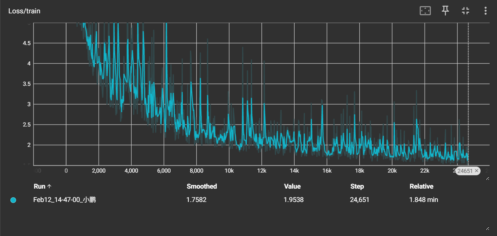
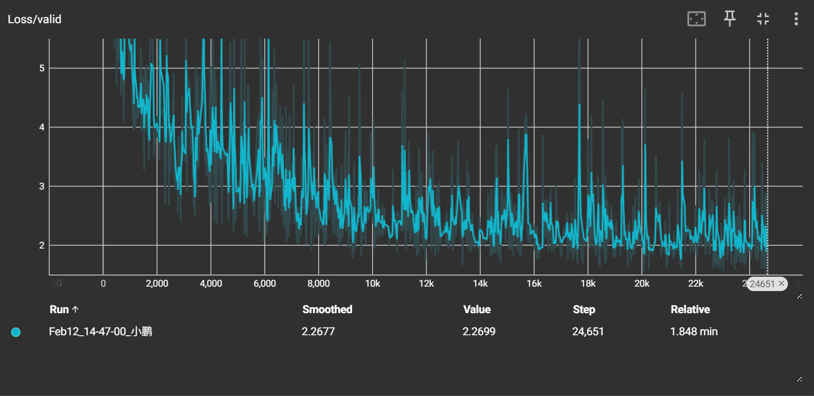
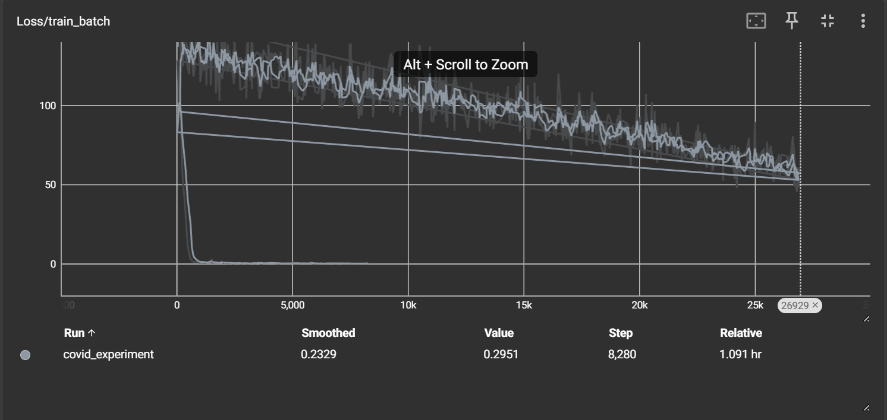
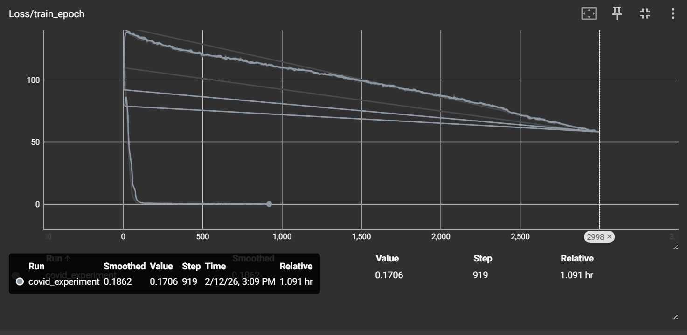
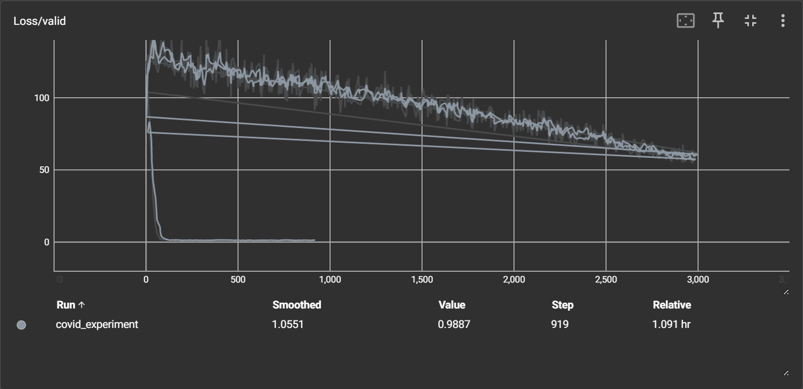

## 任务

李宏毅 HW1：COVID-19 回归预测，117 维特征。demo 是两层隐藏层（16、8），SGD 优化器。

## 结果

demo 最后 loss 在 2 左右，改完直接干到 0 附近。~震惊~

## 做了什么

- 网络加宽加深：`64 → 32 → 16 → 1`，每层加 BatchNorm
- 优化器 SGD → Adam
- 学习率从 `1e-5` 直接拉到 `1e-3`

## 易忘点

- SGD 需要极小的学习率才稳，Adam + BN 能扛更大的步长
- BatchNorm 稳定每层输入分布，加速收敛

## 图

demo：




我的：



