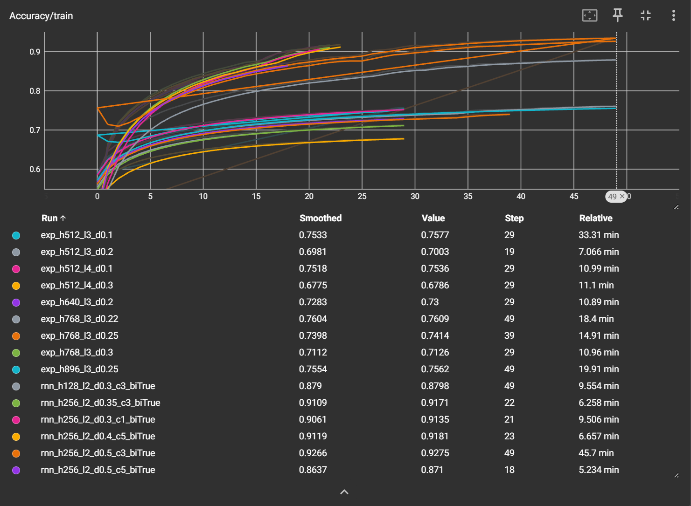
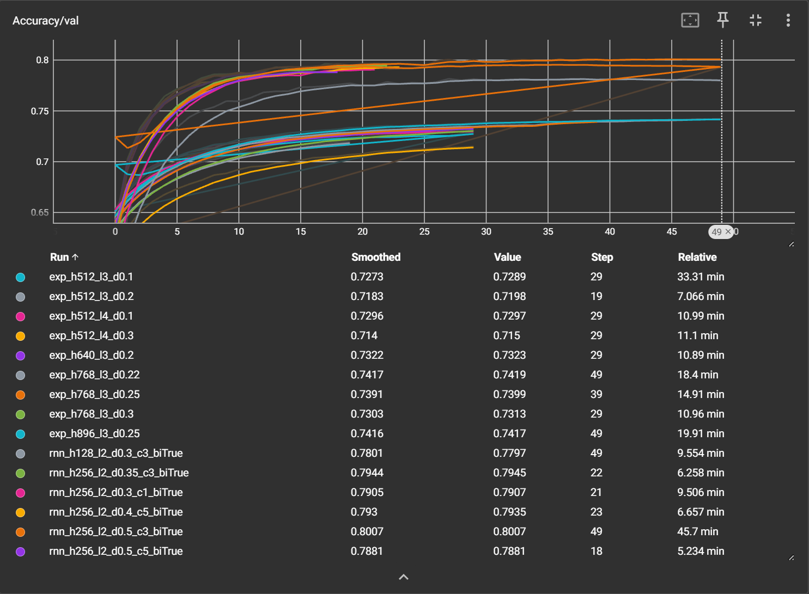
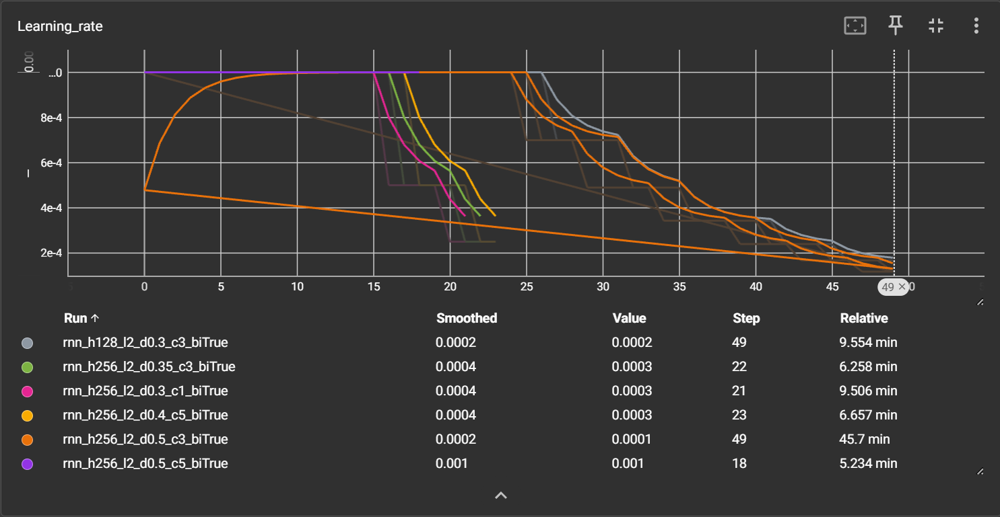

## 任务

李宏毅 HW2：音素识别，帧级别分类。输入是 39 维 MFCC，每帧预测 41 类音素之一。训练 3428 句，验证 858 句。

## 结果

val acc 跑到 **0.80**（RNN），课程 boss 线是 0.82，差一点。悲。

## 做了什么

- 基线：全连接 + `concat_nframes` 看前后帧
- 主力：换双向 LSTM
- 卡在 0.79，加 RNN 后到 0.80

## 易忘点

- 变长序列要 pack，不然 padding 会干扰 LSTM：

```python
packed_x = pack_padded_sequence(x, lengths.cpu(), batch_first=True, enforce_sorted=False)
packed_out, _ = self.lstm(packed_x)
out, _ = pad_packed_sequence(packed_out, batch_first=True)
```

## 图






