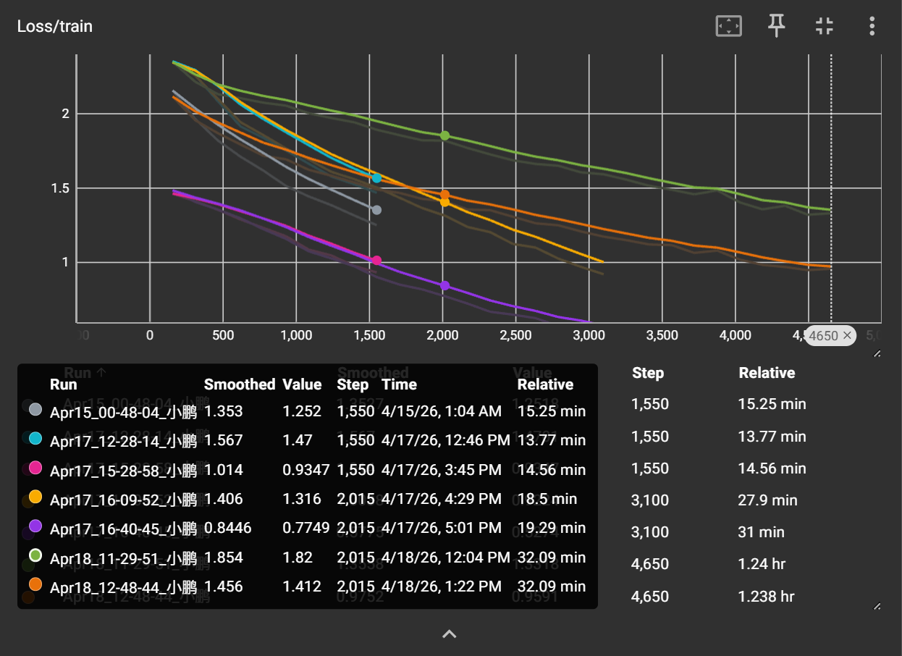
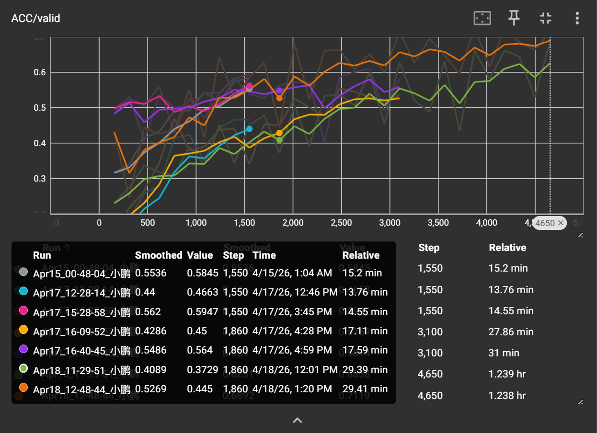

## 任务

李宏毅 HW3：食物图像分类，11 类，尺寸 124×124。

## 结果

测试集 **71.19%**（media 线）。跑到 0.7 直接摆烂了。

## 做了什么

- 基线：简单 CNN
- 试了自己写的残差网络，尺寸对不上跑不起来
- 最后用官方 ResNet-50，输入 resize 到 224，加 ImageNet 归一化
- 优化器 AdamW + CosineAnnealingLR

## 易忘点

- 残差块跳跃连接通道 / 尺寸变了要用 `1×1` 卷积投影，否则不能相加
- 输出尺寸：`(输入 + 2×padding - 卷积核) / stride = 输出`
- 分类头用全局平均池化代替手动 flatten，省得算错维度
- 训练初期 loss 变 nan，多半是数据路径配错了

## 图




